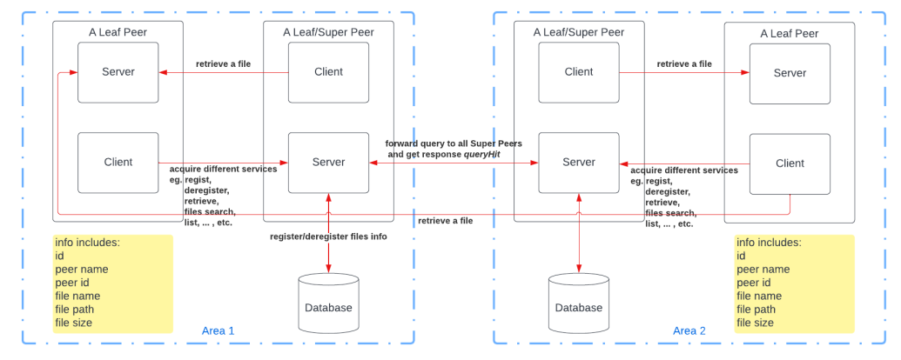
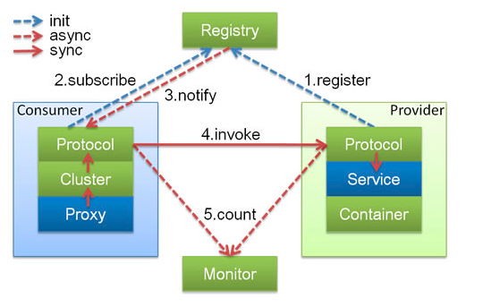

# A distributed Gnutella-Style P2P File Sharing System

## Overview

We implemented a distributed Gnutella-Style P2P file sharing system. Basically, there are four parts, which are topology structure generation, peer server, peer client and a database management. 

## Architectural Design

## Dependence Relationship

We adopt the ideas used in Dubbo Framework developed by Alibaba. 

